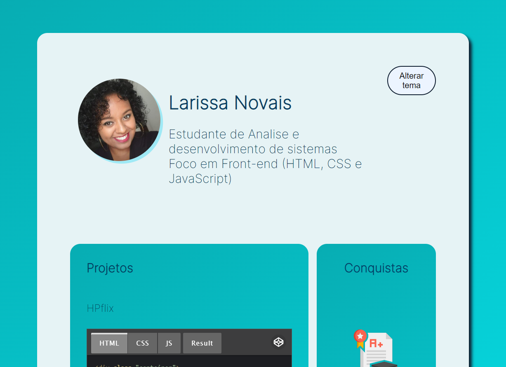

 # ImersãoDEV - ALURA

    Portfólio construido durante as semanas da imersão DEV.

 ## Tecnologias 

    🕳️HTML
    🕳️CSS
    🕳️JAVASCRIPT

    variáveis, operações e média
    array e lista
    Objetos e tabelas
    Lógica no jogo
    Figma,HTML e CSS

> Desafios realizados:

    🧭Média
    📱Calculadora
    🧿Mentalista
    🎞️AluraFlix
    🖲️Placar
    🃏Super trunfo